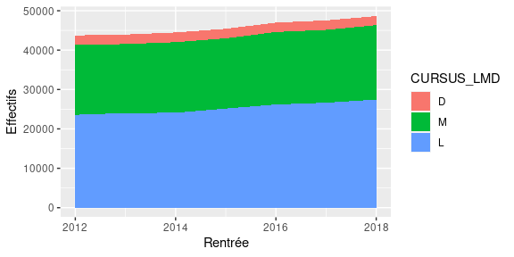
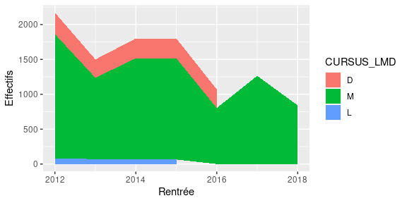
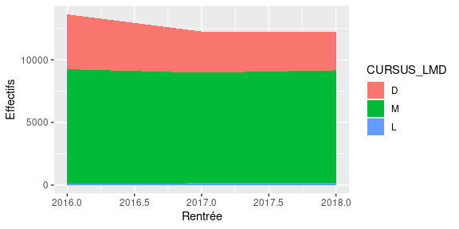

Tuto Git Rmd
================

## Chargement des données et fonction

``` r
sise <- read.csv("sise_mini.csv", header=TRUE, encoding="UTF-8")

myplot <- function(etab) {
  sise %>%
    filter(Etablissement == etab) %>%
    group_by(Rentrée, CURSUS_LMD) %>%
    summarise(Effectifs = sum(Effectifs)) %>%
    mutate(CURSUS_LMD = factor(CURSUS_LMD,levels=c("D","M","L"))) %>%
    ggplot(aes(x=Rentrée,y=Effectifs,fill=CURSUS_LMD)) +
    geom_area()
}
```

## Etablissements

``` r
for(etab in c("Université de Strasbourg","École normale supérieure Cachan/Paris-Saclay","Université Paris-Saclay")) {
  cat("\n\n###",etab,"\n")
  print(myplot(etab))
}
```

### Université de Strasbourg

<!-- -->

### École normale supérieure Cachan/Paris-Saclay

<!-- -->

### Université Paris-Saclay

<!-- -->
