Projet ACP automatisées
================

## Chargement des données et fonction

``` r
sise <- read.csv("C:/Users/quent/Desktop/ENS Paris-Saclay/1A/1S2/Atelier CPESR/sise19.csv", header=TRUE, encoding="UTF-8", sep = ";")

ACP <- function(academie) {
  db <- sise %>%
    mutate(diplome_univ=str_sub(sise$TYP_DIPL,1,1))%>%
    filter(ACAETA == academie) %>%
    filter(ETABLI != "") %>%
    mutate(niveau=paste0(CURSUS_LMD,NIVEAU)) %>%
    select(idet, ETABLI, ACAETA, SEXE, BAC_RGRP, CURSUS_LMD,niveau, DISCIPLI, PCSPAR,diplome_univ) %>%
    mutate(discipline=case_when(DISCIPLI=="1"~"Droit",
                                DISCIPLI %in% c("2","4","5","6","32","20")~"SHS",
                                DISCIPLI=="3"~"AES",DISCIPLI %in% c("15","9","33")~"SCIENCES",
                                DISCIPLI=="10"~"STAPS",DISCIPLI %in% c("11","12","13","34","40")~"SANTE",))%>%
    mutate(DU=case_when(diplome_univ=="U"~1,T~0))%>% 
    group_by(ETABLI,niveau,discipline) %>%
    summarize(academie = first(ACAETA),
              effectif = n_distinct(idet),
              hommes = mean(SEXE == 1),
              femmes = mean(SEXE == 2),
              bac_S = mean(BAC_RGRP == 3),
              bac_L = mean(BAC_RGRP == 1),
              bac_ES = mean(BAC_RGRP == 2),
              bac_pro = mean(BAC_RGRP == 6),
              bac_techno = mean(BAC_RGRP %in% c(4,5)),
              doctorats = mean(CURSUS_LMD == "D"),
              masters = mean(CURSUS_LMD == "M"),
              licences = mean(CURSUS_LMD == "L"),
              chef_ent = mean(PCSPAR == 23),
              prof_sup = mean(PCSPAR %in% c(31,33,34,35,37,38)),
              art_comm = mean(PCSPAR %in% c(21,22)),
              employe = mean(PCSPAR %in% 52:56),
              ouvrier = mean(PCSPAR %in% c(61,66,69)),
              agriculteur = mean(PCSPAR == 10),
              prof_inter = mean(PCSPAR %in% 42:48),
              du=mean(DU)) 
  
pour_PCA<-db %>% 
  mutate(poids=effectif/sum(effectif)) %>% 
  select(-effectif,-ETABLI,-academie) %>% 
  relocate(c("hommes","femmes","doctorats","masters","licences"),.after= prof_inter)

resultat_ACP<-PCA(pour_PCA[,4:22], quanti.sup= 13:17, row.w=pour_PCA$poids)
  
dbact<-as_tibble(resultat_ACP$var$coord) %>% 
  mutate(type="Var actives") %>% 
  mutate(names=c(rownames(resultat_ACP$var$coord)))

dbsup<-as_tibble(resultat_ACP$quanti.sup$coord) %>% 
  mutate(type="Var suppl") %>% 
  mutate(names=c(rownames(resultat_ACP$quanti.sup$coord)))

dbvar<-bind_rows(dbact,dbsup)

dbind<-bind_cols(db,as_tibble(resultat_ACP$ind$coord))

ggplot(dbvar,aes(x=Dim.1,y=-Dim.2,
                 label=names))+
  scale_shape_manual(values=c("triangle","square"))+
  geom_point(aes(shape=type))+
  theme(legend.title=element_blank(),
        panel.background =element_rect(fill="white"),
        legend.position=c(0.15,0.85),
        legend.background = element_rect(fill="white",size=0.5, linetype="solid",colour ="black"),
        axis.title=element_text(size=12))+
  geom_text_repel(size=4,show.legend = FALSE)+
  geom_hline(yintercept=0,linetype="dashed",colour="grey")+
  geom_vline(xintercept = 0,linetype="dashed",colour="grey")+
  ggtitle("Figure II - Graphique des variables de l'ACP en 2019")+
  xlab(paste("Axe 1 :",round(resultat_ACP$eig[1,2],0),"%"))+
  ylab(paste("Axe 2 :",round(resultat_ACP$eig[2,2],0),"%"))

ggplot(data=dbind,aes(x=Dim.1,y=-Dim.2))+
  ggtitle("Universités 2019")+
  geom_point()+
  geom_text_repel(aes(label=academie),size=3)+
  geom_hline(yintercept=0,linetype="dashed")+
  geom_vline(xintercept = 0,linetype="dashed")+
  theme(plot.title=element_text(hjust=0.5),legend.position=c(.95,.2),
        panel.background =element_rect(fill="white"),legend.title=element_blank())+
  xlab(paste("Axe 1 :",round(resultat_ACP$eig[1,2],0),"%"))+
  ylab(paste("Axe 2 :",round(resultat_ACP$eig[2,2],0),"%"))
   
}
```

## Etablissements

``` r
for(academie in c(1, 2, 3, 4, 5, 6, 7, 8, 9, 10, 11, 12, 13, 14, 15, 16, 17, 18, 19, 20, 21, 22, 23, 24, 25, 27, 28, 32, 33, 40, 41)) {
  cat("\n\n###",academie,"\n")
  print(ACP(academie))
}
```

### 1

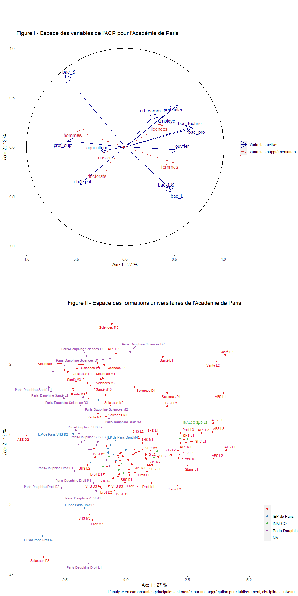<!-- --><!-- -->

    ## Warning: ggrepel: 171 unlabeled data points (too many overlaps). Consider
    ## increasing max.overlaps

<!-- -->

### 2

<!-- -->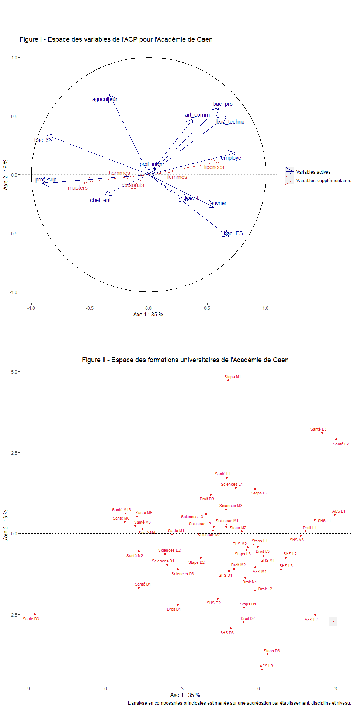<!-- -->

    ## Warning: ggrepel: 19 unlabeled data points (too many overlaps). Consider
    ## increasing max.overlaps

<!-- -->

### 3

<!-- -->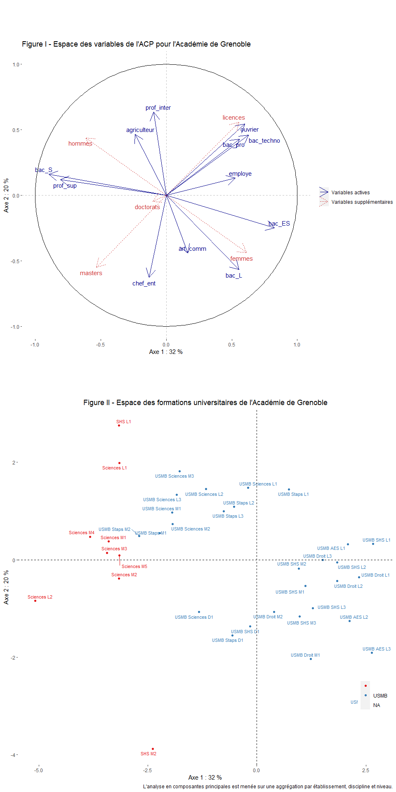<!-- --><!-- -->

### 4

<!-- -->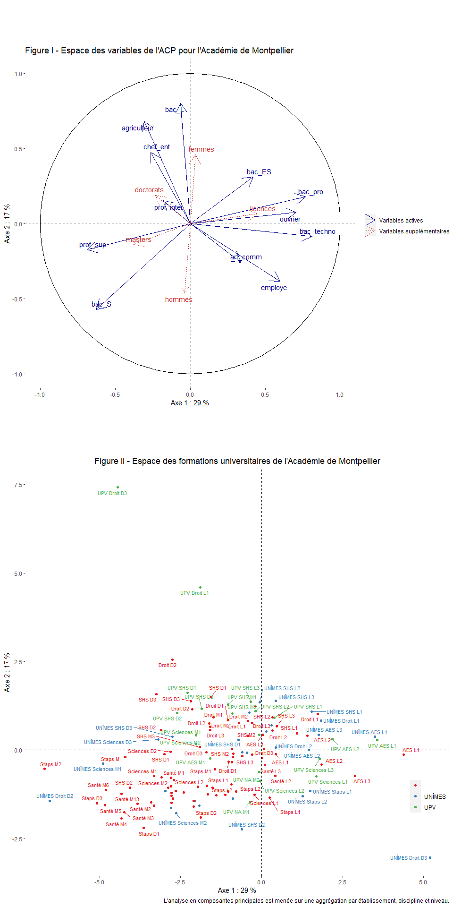<!-- -->

    ## Warning: ggrepel: 22 unlabeled data points (too many overlaps). Consider
    ## increasing max.overlaps

<!-- -->

### 5

<!-- --><!-- --><!-- -->

### 6

    ## Warning: ggrepel: 19 unlabeled data points (too many overlaps). Consider
    ## increasing max.overlaps

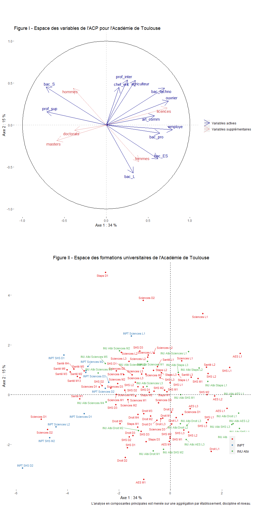<!-- --><!-- -->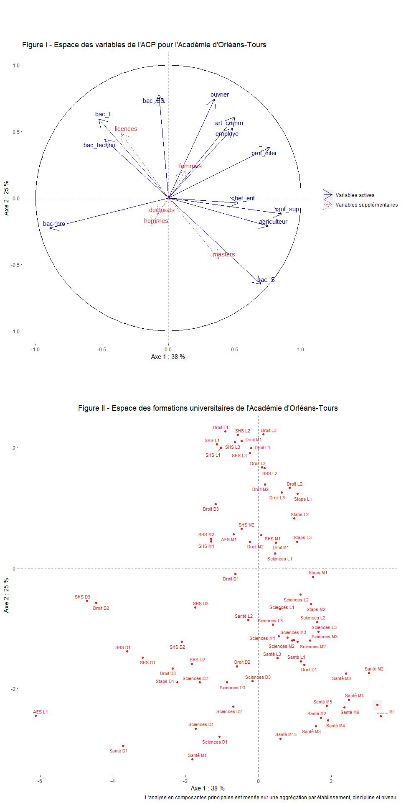<!-- -->

### 7

    ## Warning: ggrepel: 3 unlabeled data points (too many overlaps). Consider
    ## increasing max.overlaps

<!-- --><!-- -->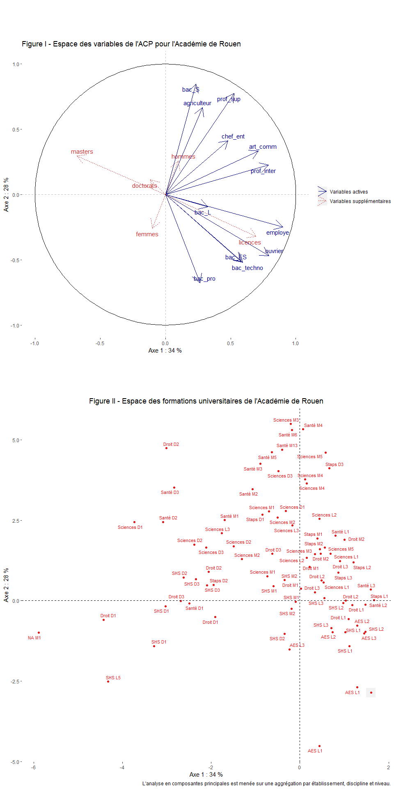<!-- -->

### 8

<!-- --><!-- -->

    ## Warning: ggrepel: 2 unlabeled data points (too many overlaps). Consider
    ## increasing max.overlaps

<!-- -->

### 9

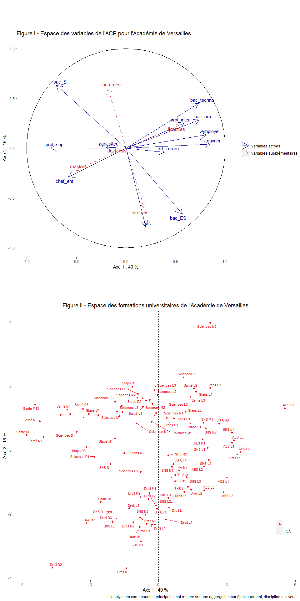<!-- --><!-- -->

    ## Warning: ggrepel: 94 unlabeled data points (too many overlaps). Consider
    ## increasing max.overlaps

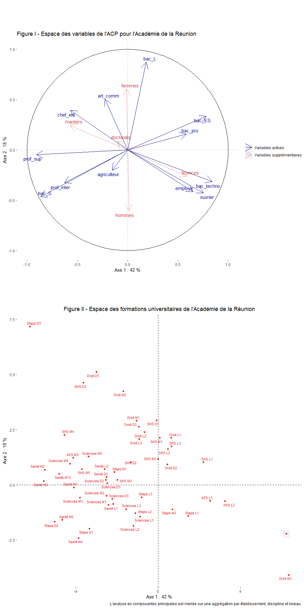<!-- -->

### 10

<!-- --><!-- -->

    ## Warning: ggrepel: 92 unlabeled data points (too many overlaps). Consider
    ## increasing max.overlaps

<!-- -->

### 11

<!-- --><!-- -->

    ## Warning: ggrepel: 37 unlabeled data points (too many overlaps). Consider
    ## increasing max.overlaps

<!-- -->

### 12

    ## Warning: ggrepel: 5 unlabeled data points (too many overlaps). Consider
    ## increasing max.overlaps

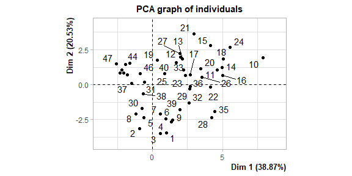<!-- --><!-- --><!-- -->

### 13

<!-- -->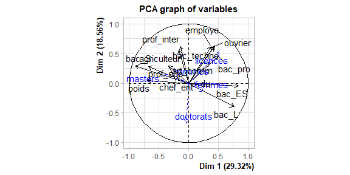<!-- -->

    ## Warning: ggrepel: 30 unlabeled data points (too many overlaps). Consider
    ## increasing max.overlaps

<!-- -->

### 14

<!-- --><!-- -->

    ## Warning: ggrepel: 121 unlabeled data points (too many overlaps). Consider
    ## increasing max.overlaps

<!-- -->

### 15

<!-- -->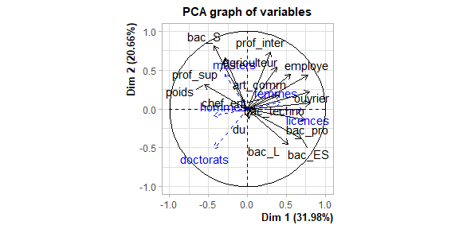<!-- -->

    ## Warning: ggrepel: 4 unlabeled data points (too many overlaps). Consider
    ## increasing max.overlaps

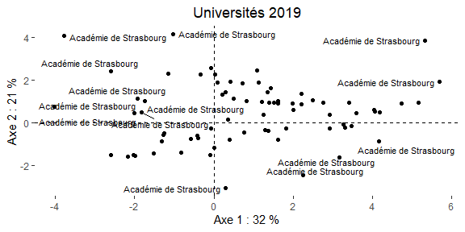<!-- -->

### 16

<!-- -->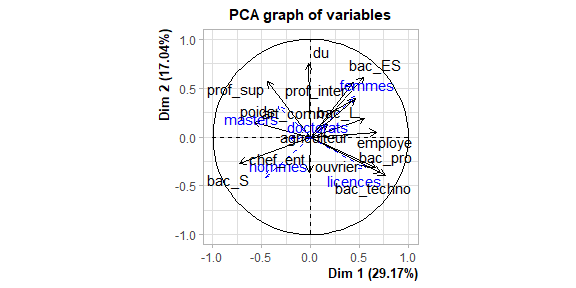<!-- -->

    ## Warning: ggrepel: 54 unlabeled data points (too many overlaps). Consider
    ## increasing max.overlaps

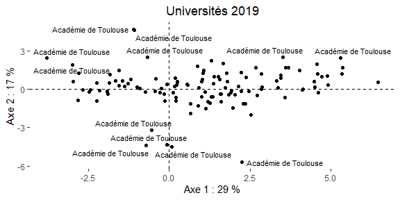<!-- -->

### 17

<!-- --><!-- -->

    ## Warning: ggrepel: 19 unlabeled data points (too many overlaps). Consider
    ## increasing max.overlaps

<!-- -->

### 18

<!-- -->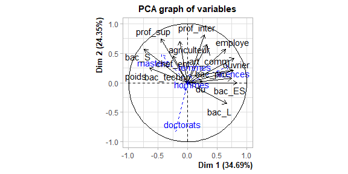<!-- -->

    ## Warning: ggrepel: 5 unlabeled data points (too many overlaps). Consider
    ## increasing max.overlaps

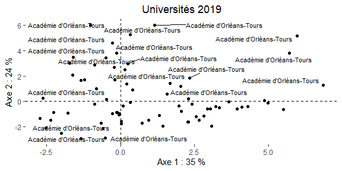<!-- -->

### 19

<!-- -->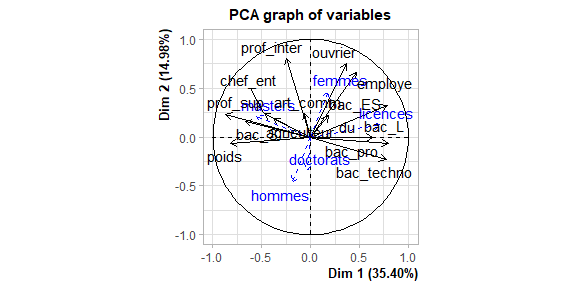<!-- -->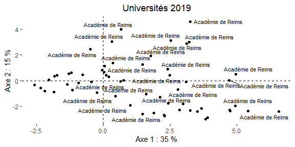<!-- -->

### 20

<!-- --><!-- -->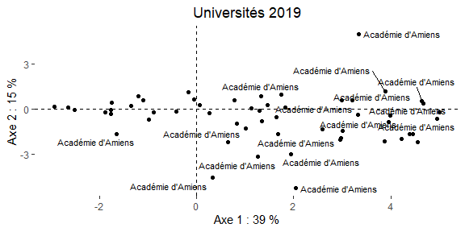<!-- -->

### 21

<!-- -->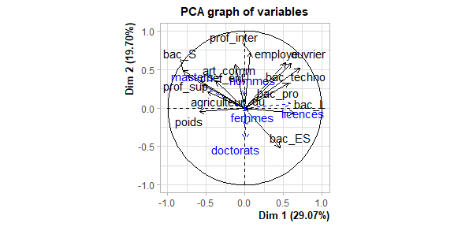<!-- -->

    ## Warning: ggrepel: 9 unlabeled data points (too many overlaps). Consider
    ## increasing max.overlaps

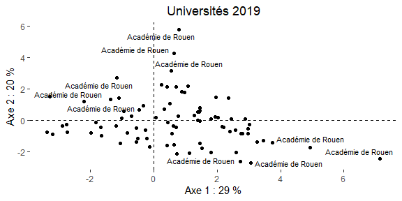<!-- -->

### 22

    ## Warning: ggrepel: 6 unlabeled data points (too many overlaps). Consider
    ## increasing max.overlaps

<!-- --><!-- -->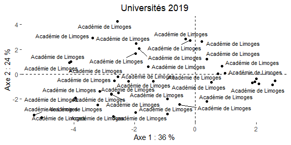<!-- -->

### 23

<!-- -->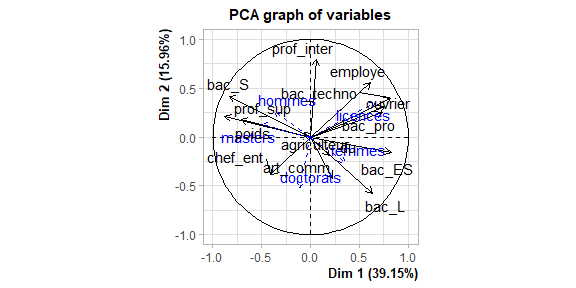<!-- -->

    ## Warning: ggrepel: 7 unlabeled data points (too many overlaps). Consider
    ## increasing max.overlaps

<!-- -->

### 24

<!-- --><!-- -->

    ## Warning: ggrepel: 99 unlabeled data points (too many overlaps). Consider
    ## increasing max.overlaps

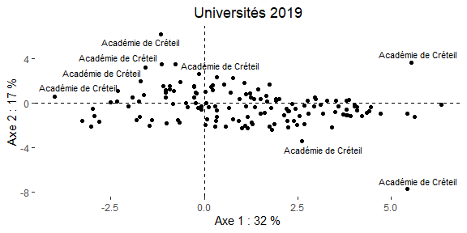<!-- -->

### 25

<!-- --><!-- -->

    ## Warning: ggrepel: 116 unlabeled data points (too many overlaps). Consider
    ## increasing max.overlaps

<!-- -->

### 27

    ## Warning: ggrepel: 9 unlabeled data points (too many overlaps). Consider
    ## increasing max.overlaps

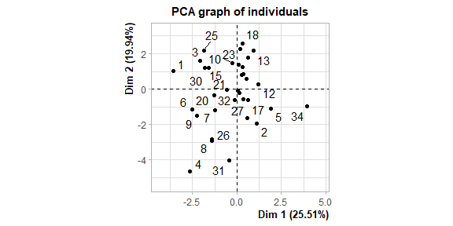<!-- --><!-- -->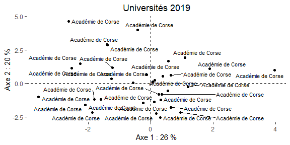<!-- -->

### 28

<!-- -->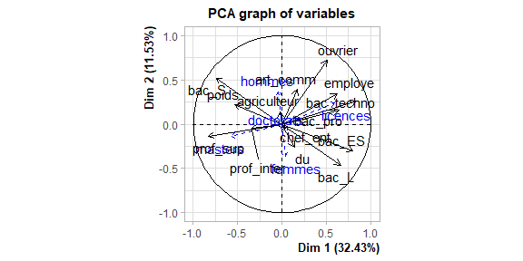<!-- -->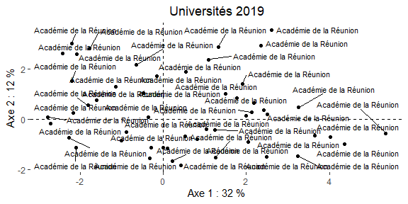<!-- -->

### 32

    ## Warning: ggrepel: 24 unlabeled data points (too many overlaps). Consider
    ## increasing max.overlaps

<!-- --><!-- -->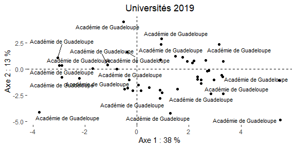<!-- -->

### 33

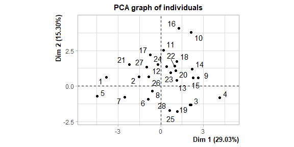<!-- --><!-- --><!-- -->

### 40

    ## Warning: ggrepel: 5 unlabeled data points (too many overlaps). Consider
    ## increasing max.overlaps

<!-- --><!-- -->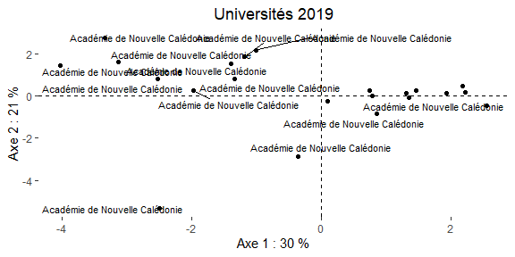<!-- -->

### 41

<!-- -->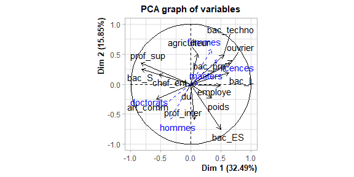<!-- -->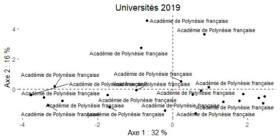<!-- -->
