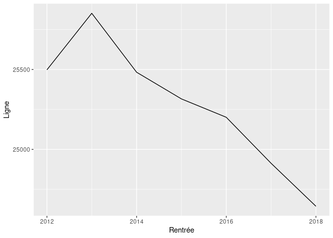
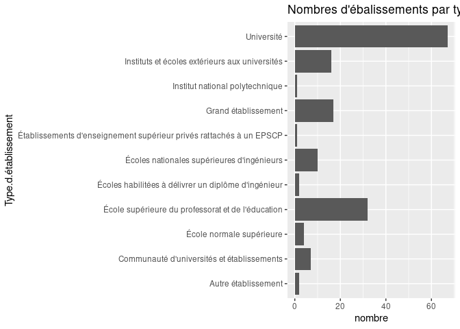

Tuto Git Rmd
================

## Chargement des données

Colonnes :

    ##  [1] "RENTREE"              "ETABLISSEMENT"        "Etablissement"       
    ##  [4] "Type.d.établissement" "Discipline"           "Diplôme"             
    ##  [7] "DN_DE"                "Mobilité"             "CURSUS_LMD"          
    ## [10] "NIVEAU"               "Effectifs"            "Niveau"              
    ## [13] "Rentrée"

<!-- -->

**Analyse** : Le nombre de lignes dans les données décroit depuis
l’année 2013, ce qui ne nous dit pas grand chose sur les effectifs
étudiants en France.

## Idées de visualisations

### Nombre d’établissements par type

<!-- -->

### Nombre détablissements par an

<!-- -->

### Taille des établissements par type

<!-- -->

### Nombre détudiants par niveau

<!-- -->

### Nombre détudiants par mobilité

<!-- -->
